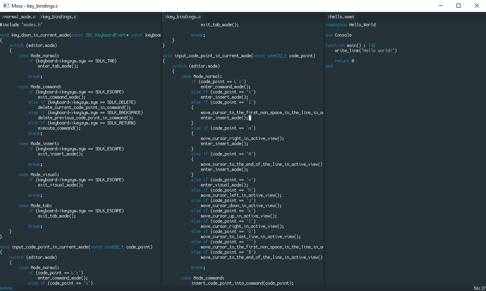

Moss
====

This is a proof of concept of a Modal text editor for my personal use. Supply
`moss.exe` with paths to the files you want to open. This is temporary.

# Modes
## NORMAL
* `Tab` Enters TAB mode.
* `:` Enters COMMAND mode.
* `i` Enters INSERT mode.
* `I` Enters INSERT mode at the first non-space character on the current line.
* `a` Enters INSERT mode at the next character on the current line.
* `A` Enters INSERT mode at the end of the current line.
* `v` Enters VISUAL mode.
* `h` Moves the cursor to the previous character on the current line.
* `j` Moves the cursor to the next line and the current column is prefered.
* `k` Moves the cursor to the previous line and the current column is prefered.
* `l` Moves the cursor to the next character on the current line.
* `G` Moves the cursor to the last line and the prefered column is ignored.
* `^` Moves the cursor to the first non-space character on the current line.
* `$` Moves the cursor to the end of the current line.

## INSERT
* `ESC` Enters NORMAL mode.

## COMMAND
Write a command then pres `Enter` to execute it and enter NORMAL mode. You can
also go back to NORMAL mode by pressing `ESC`.

* `w` Flushes the active buffer.

## VISUAL
* `ESC` Enters NORMAL mode.

## TAB
* `ESC` Enters NORMAL mode.
* `h` Moves the active view to the left.
* `j` Moves the active view to the right.
* `H` Moves the active tab to the left.
* `J` Moves the active tab to the right.
* `k` Puts the active view in a new tab to the left. 
* `l` Puts the active view in a new tab to the right.
* `K` Puts the active view in existing tab to the left.
* `L` Puts the active view in existing tab to the right.
* `f` Activate left hand side view in active tab.
* `g` Activate right hand side view in active tab.
* `d` Activate right hand side tab.
* `s` Activate left hand side tab.
* `C` Close active tab.

# File encodings
Files opened are expected to be UTF8 encoded.

# Rendering
The rendering is done entirely using 

* [SDL_RenderFillRect](https://wiki.libsdl.org/SDL_RenderFillRect)
* [SDL_RenderCopy](https://wiki.libsdl.org/SDL_RenderCopy)
* [SDL_RenderDrawLine](https://wiki.libsdl.org/SDL_RenderDrawLine)

## Font rendering
While UTF8 is supported the rendering is centered around whats on the 
[Character map](character_map.txt). Do note some characters on there is
rendered as Tofu (U+FFFD). Only left to right text is considered. Ligatures
are not a thing in this editor. To add more glyphs from the Basic Multilingual
Plane check out [cozette.c](src/renderer/cozette.c).

# GPU usage
Rendering is GPU accelerated but no frames are drawn unless resizing, typing or
something simmilar happens that requires drawing a new frame.

# Building
## Windows
1. Open up the [Visual Studio Developer Command Prompt](https://docs.microsoft.com/en-us/visualstudio/ide/reference/command-prompt-powershell?view=vs-2019) with the `x64` environment.
2. Navigate to the root directory.
3. Run `build.bat`

`moss.exe` should sit in `root/bin/`.

# Dependencies
* I use the a subset of the [Cozette](https://github.com/slavfox/Cozette) font. Check out [cozette.c](src/renderer/cozette.c) for more details.
* [SDL2](https://www.libsdl.org/).
